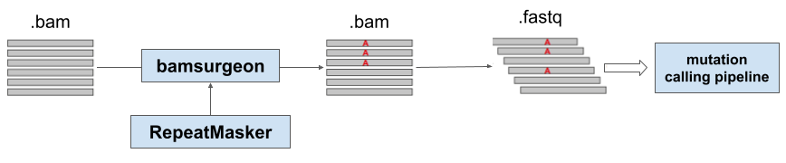

# Somatic mutation calling validation using in silico approach
Authors
* Gleb Khegai
* Anastasia Yudina
* Danil Stupichev

## Introduction
There are many tools for analyzing WES (whole exome sequencing) data that can detect germline and somatic mutations, copy number changes, and other events in tumor and normal tissue samples. However, it is important not only to find the event, but also to prove whether the evidence is true. For these purposes, there is a procedure for the validation of a clinical test. As part of it, several technical and biological replicas of test samples are usually analyzed to check the assay for accuracy, sensitivity, robustness and reproducibility. When using model cell lines for validation, information about genomic events is usually obtained from previous studies collected in databases (COSMIC), or established during pre-validation experiments.

However, existing validation approaches on cell lines do not cover all requests for assessing the accuracy/sensitivity of genetic testing. For example, in cell lines, genetic events tend to occur within cell specific clinically actionable genes, so they are not always evenly distributed. Therefore, when validating a certain set of genes, extrapolation of quality metrics to the entire exome may be incorrect due to sequence features. On the other hand, when validating on real tumor tissues with a heterogeneous cellular composition, the concept of a “true” event is blurred, since it directly depends on the pipeline settings. This is the reason we decided to explore the use of in silico methods1 to fine-tune and validate a pipeline for identifying somatic mutations in WES samples.
## Aim
Explore the use of in silico methods to fine-tune and validate a pipeline for identifying of somatic mutations in Whole Exome Sequencing samples
## Objectives
* Develop pipelines for sample dilution and mutation introduction
* Compare reproducibility of mutation filtration approaches on artificially diluted samples
* Introduce mutations in real samples and compare performance of different mutation approaches
## Methods

In order to evaluate mutation calling pipeline performance two artificial approaches were utilised.

### Installation requirements

1. First of all you should install python3.8 packages in order to successfully use notebooks for analysis:
```
pip install -r requirements.txt
```

2. Samtools v1.7 should be installed in your system as well.
3. Bamsurgeon v1.4.1 was used in this project though the docker.
```
git clone https://github.com/adamewing/bamsurgeon.git
cd bamsurgeon
docker image build -t bamsurgeon:1.4.1 .
docker run -it --rm -v /folder/path/to/mount:/docker_data bamsurgeon:1.4.1
```

### Artificial dilution


Artificial dilution pipeline consists of several steps:
1. Count reads in tumor and normal .fastq files
```
zcat tumor.fastq.gz | wc -l
```
Details about futher steps can not be provided as they are protected *by NDA*. Below provided common description of the following steps.

2. Calculate the proportion of reads required to obtain desired purity. You can use the following equation to obtain required fraction of tumor reads in order to make a sample with $purity_{new}$
    
$fraction = \frac{purity_{new} \cdot (1 - purity + 0.5 \cdot ploidy \cdot purity)}{purity \cdot (1 - purity_{new} + 0.5 \cdot ploidy \cdot purity_{new})}$

3. Downsample $fraction \cdot reads_{tumor}$ reads from tumor .fastq files and $(1 - fraction) \cdot reads_{tumor}$ reads from normal .fastq files
4. Merge corresponding files to obtain artificially diluted .fastq file
5. Repeat the same to obtain artificially diluted samples with purity 10, 20, 30, 50 and 75 (if it is possible).
6. Mutation calling was performed with Strelka V2.9.10. 

### **Mutation introduction**



Mutation introduction pipeline consists of several steps:
1. Introdice mutations into the normal .bam with bamsurgeon v1.4.1
```
python3 -O bamsurgeon/bin/addsnv.py -p 10 -v mutations/snvs_{1/2}_{purity}.txt -f input.bam -r {commencial_secret}.fa -o output_{1/2}_1.bam --seed 42 --mindepth 1
```
```
python3 -O bamsurgeon/bin/addindel.py -p 10 -v docker_data/config/indel_{1/2}_{purity}.txt -f output_{1/2}_1.bam -r {commencial_secret}.fa -o output_{1/2}_2.bam --seed 42 --mindepth 1
```
2. Make .fastq from .bam files with samtools v1.7
```
samtools fastq -1 file_{1/2}_1.fastq -2 file_{1/2}_2.fastq output_{1/2}_2.bam
```

The details about all data used in this project is *commencial_secret*. Some details about generation of files from `mutations` folder can be found in `notebooks/1_region_search.ipynb`.

## Results

1. Somatic mutation VAF for patients with downsampled purity


2. Reproducibility against purity for several mutation filter approaches


3. Recall and precision on in silico generated data


More details could be found in [detailed presentation](https://docs.google.com/presentation/d/1dNnKSAN0jQM4Ujiv-OcsupxeEnzkb_OIbkfU7bpEycI/edit#slide=id.p6)
## Conclusions
* Internal filters perform much better across the range of purity available, compared to basic filtrations
* The current filter works much better at high purity, while the new filter copes well with low purity samples
* While both filters do well in calling precision, the new filter has a much better performance in terms of recall especially in the low purity range

## Data and code availability
All the used data (including .bam files, .maf files, reference .fasta files) are protected *by NDA*. Some of the code for graphics plotting, bamsurgeon usage could be foud in notebooks, excepth for mutation calling pipeline, current and new filters as they are protected *by NDA*. Nevertheless, as soon as they will be published, the article link will be attached.


## References
* Duncavage EJ, Coleman JF, Baca ME de, et al. Recommendations for the Use of in Silico Approaches for Next-Generation Sequencing Bioinformatic Pipeline Validation: A Joint Report of the Association for Molecular Pathology, Association for Pathology Informatics, and College of American Pathologists. J Mol Diagn. 2023;25(1):3-16. doi:10.1016/j.jmoldx.2022.09.007
* Oh E, Choi YL, Kwon MJ, et al. Comparison of Accuracy of Whole-Exome Sequencing with Formalin-Fixed Paraffin-Embedded and Fresh Frozen Tissue Samples. PLOS ONE. 2015;10(12):e0144162. doi:10.1371/journal.pone.0144162
* Kim S, Scheffler K, Halpern AL, et al. Strelka2: fast and accurate calling of germline and somatic variants. Nat Methods. 2018;15(8):591-594. doi:10.1038/s41592-018-0051-x
* Hubley R. rmhubley/RepeatMasker. Published online May 22, 2023. Accessed May 22, 2023. https://github.com/rmhubley/RepeatMasker
* adamewing, Lundberg M, Martin R, et al. adamewing/bamsurgeon: 1.4.1. Published online August 24, 2022. doi:10.5281/zenodo.7019232
